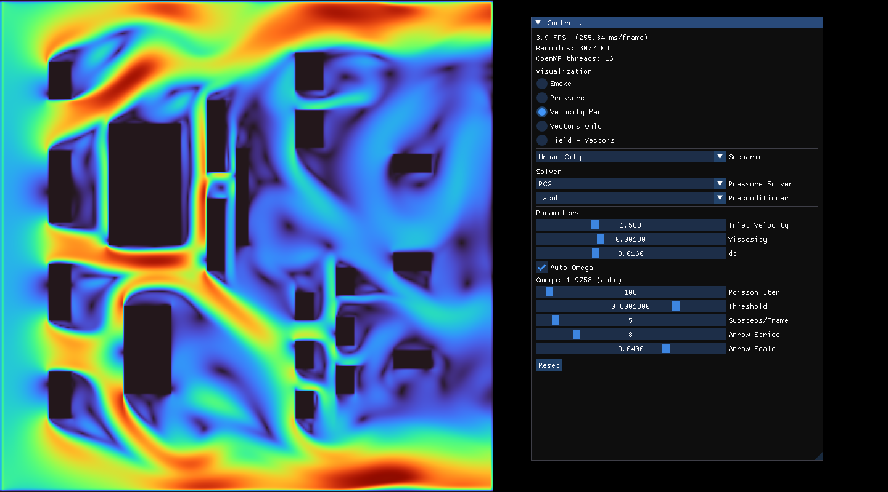
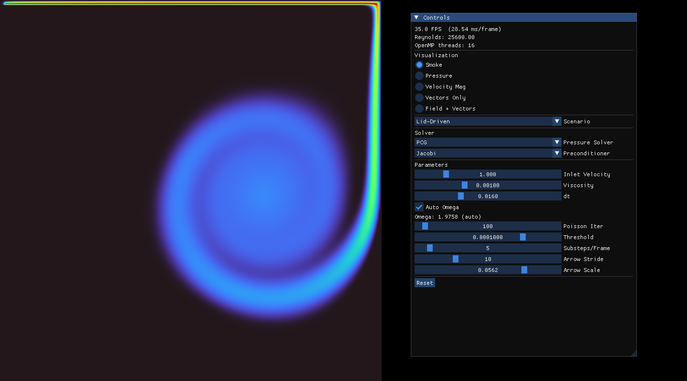
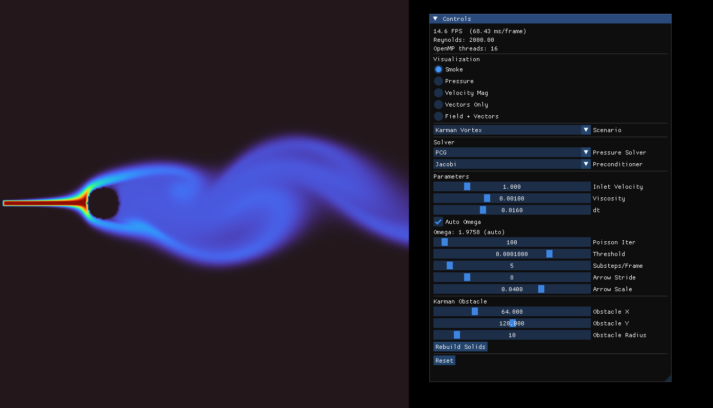

# GraphicsEngine

An interactive, real-time 2D incompressible fluid simulator with a live OpenGL viewer. The numerical core is C, the renderer and UI are C++17, and the hot loops are parallelized with OpenMP. Pressure projection, preconditioner, scenario, and physical parameters can all be changed at runtime from a Dear ImGui panel.

The physics engine lives under `src/fluid_physics/` as a Git submodule pointing at [atahancetindemir/fluid-graphics](https://github.com/atahancetindemir/fluid-graphics).



## Highlights

- 2D incompressible Navier–Stokes on a staggered MAC grid
- Four scenarios: Lid-Driven Cavity, Kármán Vortex Street, NACA 2412 Airfoil, Urban City
- Three pressure solvers (PCG, Red-Black Gauss-Seidel, SOR) swappable at runtime
- Three preconditioners (Identity, Jacobi, Multigrid placeholder) for PCG
- Five visualization modes: smoke, pressure, velocity magnitude, vectors, field + vectors
- OpenMP parallelism, Turbo colormap on an `R32F` texture

## Visualization Modes

| Mode | What's rendered |
|---|---|
| **Smoke** | Passively advected scalar tracer in `[0, 1]`. Best for showing flow patterns. |
| **Pressure** | Pressure field, auto-normalized to the current min/max each frame. |
| **Velocity Magnitude** | `\|v\|` heatmap from cell-centered averages of the staggered components. |
| **Vectors Only** | Velocity arrows on a black background. |
| **Field + Vectors** | Velocity magnitude heatmap overlaid with arrows. |



## Scenarios

| Scenario | Description |
|---|---|
| **Lid-Driven Cavity** | Classic benchmark: a square box with one moving wall (top lid) and three no-slip walls. |
| **Kármán Vortex Street** | Flow past a circular cylinder. Obstacle position and radius are user-adjustable; produces the alternating vortex shedding pattern. |
| **NACA 2412 Airfoil** | Flow around a NACA 2412 profile at zero angle of attack. |
| **Urban City** | Channel flow through a synthetic urban geometry (multiple blocky obstacles). |

Switching the scenario at runtime resets the simulation state and rebuilds the solid mask.



## How It Works

### Physics (C — `src/fluid_physics/`)

Each `fluid_step` performs the classical projection method on a MAC staggered grid:

1. Apply scenario sources (inlet velocity, body forces).
2. Diffuse velocity — explicit or implicit, chosen automatically from the diffusion number.
3. Advect velocity with semi-Lagrangian self-advection.
4. Compute divergence of the intermediate field.
5. Solve `∇²p = ρ/dt · ∇·u*` with the selected solver (PCG / RBGS / SOR).
6. Subtract `∇p` to project velocity onto the divergence-free subspace.
7. Apply boundary conditions (no-slip on the solid mask, inflow/outflow on domain edges).
8. Advect the smoke tracer.

Velocities live on a staggered MAC grid (`u` on horizontal faces, `v` on vertical faces, pressure at cell centers), which gives a clean second-order divergence/gradient stencil and avoids the checkerboard pressure mode. Solvers and preconditioners are stored as function pointers on the `FluidContext`, so swapping them at runtime is a single assignment.

**Pressure solvers:** PCG (default, best convergence, uses the preconditioner slot), Red-Black Gauss-Seidel (two independent sweeps per iteration, naturally parallel), SOR (with user-set or auto-computed ω). **Preconditioners:** Identity (plain CG), Jacobi (`M⁻¹ = diag(A)⁻¹`, default), Multigrid (placeholder, not implemented).

### Graphics (C++17 — `src/graphics_engine.{hpp,cpp}`)

- OpenGL 4.6 Core Profile with two shader programs.
- **Field shader**: full-screen quad reading an `R32F` texture, normalized against the current min/max and colormapped with a polynomial Turbo approximation.
- **Arrow shader**: line segments uploaded from a CPU-built vertex buffer (shaft + two head wings per arrow).
- Dear ImGui is layered on top via the GLFW + OpenGL3 backends and rebuilt each frame.

### Glue (`src/main.cpp`)

Per frame: recompute auto-omega if enabled → run N `fluid_step` substeps → draw the ImGui panel and honor any reset/rebuild requests → update the field texture and/or arrow buffer for the active mode → render and present.

## Controls

The ImGui side panel exposes everything that can change at runtime:

- **Visualization** — radio buttons for the five modes.
- **Scenario** — combo box; switching rebuilds the simulation.
- **Pressure Solver / Preconditioner** — swap function pointers instantly.
- **Inlet Velocity / Viscosity / dt / Omega** — float sliders. Omega is read-only when "Auto Omega" is checked.
- **Poisson Iter / Threshold** — solver budget and convergence target.
- **Substeps/Frame** — increases simulation rate at the cost of frame time.
- **Arrow Stride / Arrow Scale** — visualization-only.
- **Kármán Obstacle** — extra X / Y / radius sliders and a "Rebuild Solids" button when the active scenario is the vortex street.
- **Reset** — re-runs scenario init while preserving parameter values.

Header line reports FPS, frame time, Reynolds number, and OpenMP thread count.

## Default Parameters

Defined as `constexpr` at the top of `src/main.cpp`:

| Parameter | Default | Meaning |
|---|---|---|
| Window | 800 × 800 | GLFW window size |
| Grid | 256 × 256 | Simulation resolution |
| `dt` | 0.016 s | Timestep |
| `dx` | 0.1 m | Cell size |
| Density | 1.0 | Fluid density |
| Viscosity | 0.001 | Dynamic viscosity |
| Poisson iterations | 100 | Max iterations for the pressure solver |
| Threshold | `1e-4` | Max-residual convergence target |
| Substeps/frame | 5 | `fluid_step` calls per rendered frame |
| Arrow stride / scale | 8 / 0.04 | Spacing and length multiplier for arrows |

## Tech Stack

| Component | Version / Notes |
|---|---|
| C / C++ | C11 / C++17 |
| CMake | 3.20+ |
| GLFW | 3.4 (via `FetchContent`) |
| Dear ImGui | v1.91.5 (via `FetchContent`) |
| GLAD | OpenGL 4.6 loader |
| OpenMP | linked when found |
| Fluid engine | [atahancetindemir/fluid-graphics](https://github.com/atahancetindemir/fluid-graphics) as a submodule |

## Project Layout

```
.
├── CMakeLists.txt
├── assets/shaders/        # field.vert/frag, arrow.vert/frag
├── include/               # glad, KHR headers
└── src/
    ├── main.cpp           # main loop + ImGui panel
    ├── graphics_engine.*  # OpenGL renderer
    ├── glad.c
    └── fluid_physics/     # submodule (C fluid engine)
```

## Getting Started

```bash
git clone --recursive https://github.com/ozgurd5/GraphicsEngine.git
cmake -S . -B build -G Ninja
cmake --build build
./build/GraphicsEngine
```

If you cloned without `--recursive`, run `git submodule update --init src/fluid_physics` first. Launch from the repo root so `assets/shaders/` is reachable — the renderer loads shaders with relative paths. CLion opens the project out of the box.

## Updating the Fluid Engine

A submodule is pinned to a commit. To track the upstream `main`:

```bash
git submodule update --remote src/fluid_physics
git add src/fluid_physics
git commit -m "Update fluid_physics submodule"
```

This manual step is intentional — it prevents the engine from changing under you between builds.

## Credits

- Fluid engine: [atahancetindemir/fluid-graphics](https://github.com/atahancetindemir/fluid-graphics) by Atahan Çetindemir.
- [GLFW](https://www.glfw.org/), [Dear ImGui](https://github.com/ocornut/imgui), [GLAD](https://glad.dav1d.de/).
- [Turbo colormap](https://blog.research.google/2019/08/turbo-improved-rainbow-colormap-for.html) (Mikhailov, Google Research, 2019).
